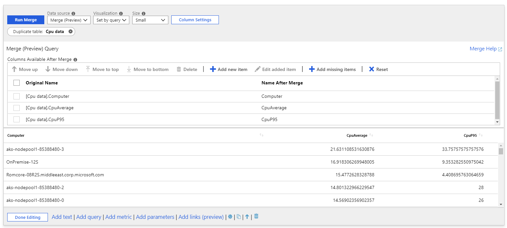

# Reusing query data in different visualizations

There are times where you want to visualize the underlying data set in different ways without having to pay the cost of the query each time. This sample shows you how to do so using the `Merge` option in the query control.

## Setup parameters

1. Create an empty workbook.
2. Click `Add query` to create a query control.
    1. Data source: `Logs`
    2. Resource type: `Log Analytics`
    3. Log Analytics workspace: _Pick one of your workspaces that has performance data_
    4. Log Analytics workspace Logs Query
        ```sql
        Perf
        | where CounterName == '% Processor Time'
        | summarize CpuAverage = avg(CounterValue), CpuP95 = percentile(CounterValue, 95) by Computer
        | order by CpuAverage desc
        ```
    4. Click the `Run Query` button to see the results. This is the result data set that we want to reuse in multiple visualizations.

        
    5. Go to the `Advanced settings` tab:
        1. Step name: `Cpu data` - this gives a friendly name for referencing the data later. 


3. Click `Add query` to create another query control.

    1. Data source: `Merge (Preview)`

    2. Click the `Add Merge` button.
    3. In the settings pop-up, set:
        1. Merge Type: `Duplicate table`
        2. Table: `Cpu data`
    4. Click the `Run Merge` button in the toolbar. This shows the same result as above:
    
        

4. There are some table options for you here:
    1. Use the `Name After Merge` column to set friendly names for your result columns. 
        1. For instance you can rename `CpuAverage` to `CPU utilization (avg)`. 
        2. Use the `Run Merge` button to update the result set.

    2. Use the `Delete` button to remove a column.
        1. Select the `[Cpu data].CpuP95 row
        2. Use the `Delete` button in the query control toolbar.
        3. Use the `Run Merge` button to see the result set without the CpuP95 column

    3. Change the order of the columns using the `Move up` or `Move down` buttons in the toolbar.
    4. Add new columns based on values of other columns using the `Add new item` button in the toolbar. This option will be covered in a separate sample.

5. Style the table using the options in the `Column settings` to get the visualization you want.
6. Add more query controls working against the `Cpu data` result set if needed. Here is an example that shows Average and P95 CPU utilization side by side.

    

