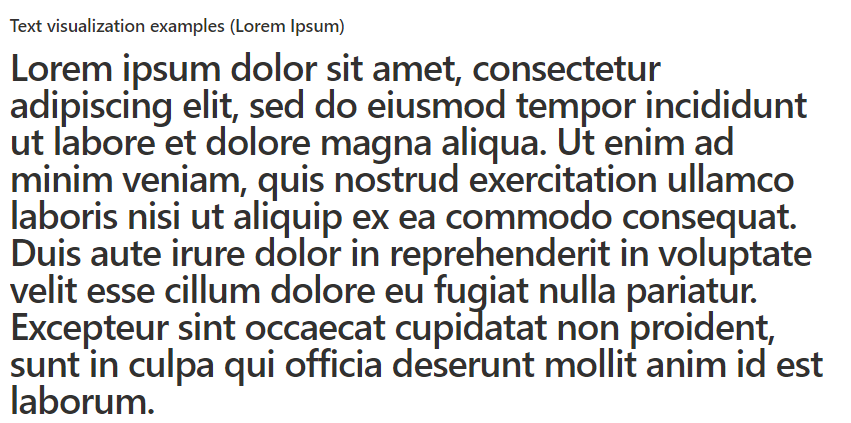
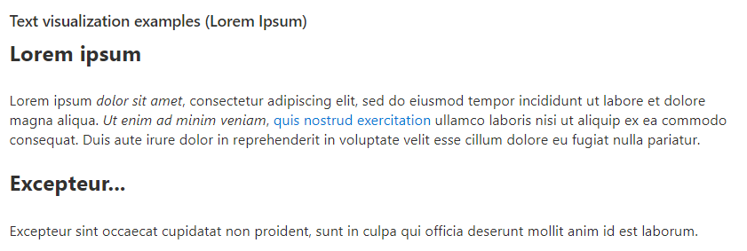

# Text Visualization

The text *visualization* in query steps is different from the [text *step*](Text.md). A text step is a top level item in a workbook, and supports replacing parameters in the content, and allows for error/warning styling.

The text *vizualization* is similar to the Azure Data Explorer [`render card`](https://docs.microsoft.com/en-us/azure/data-explorer/kusto/query/renderoperator?pivots=azuredataexplorer) behavior, where the first cell value returned by the query (and *only* the first cell value: row 0, column 0) is displayed in the visualization.

The text visualization has a style settings to change the style of the text displayed in the workbook.

### Text styles
The following text styles are available for text steps:
style | explanation
---|---
`plain` | No additional formatting is applied, the text value is presumed to be plain text and no special formatting is applied
`header` | The text is formatted with the same styling as step headers
`bignumber` | The text is formatted in the "big number" style used in [Tile](Tiles.md) and [Graph](Graph.md) based visualizations.
`markdown` | The text value is rendered in a markdown section, any markdown content in the text content will be interpreted as such and used for formatting.
`editor` | The text value is displayed in a editor control, respecting newlines, tab formatting.

### Examples

Given a query that returns text in a cell, showing in the standard grid visualization:

You can see that this query returned a single column of data, which appears to be a very long string. In all examples the query step has the same header set.

### Plain example
When the visualization is set to `Text` and the `Plain` style is selected, the text appears as a standard portal text block:

Text will wrap, and any special formatting values will be displayed as is, with no formatting.

### Header example

Text will be displayed in the same style as step headers.

### Big Number example

Text will be displayed in big number style.

### Markdown example
For the markdown example, the query response has been adjusted to have markdown formatting elements inside. Without any markdown formatting in the text, the display will be similar to the plain style.

### Editor example:
For the editor example, newline `\n` and tab `\t` characters have been added to the text to create multiple lines.

Notice how in this example, the editor has horizontal scrollbar, indicating that some of the lines in this text are wider than the control.

